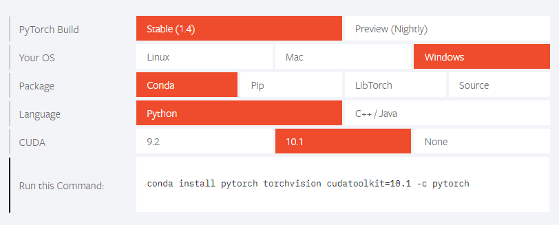

## Pytorch-Installation-on-windows using anaconda

#Install Cuda toolkit
1. check which cuda toolkit is supported with your pytorch version https://pytorch.org/
the current pytorch supports cuda toolkit 10.2 so I will need to install cuda 10.2

2. from nvidia website find your cuda toolkit version (may need to look for previous versions)
I got cuda toolkit 10.2 which is a previous release from https://developer.nvidia.com/cuda-downloads?target_os=Windows&target_arch=x86_64&target_version=10&target_type=exenetwork

## Install pytorch from anaconda

pytorch will generate the command to use in anaconda command and prompt. for me it was as follows. I do see cudatoolkit-10.1.243 getting installed during this process so the previous step might not be needed. but I never tested that theory.

conda install pytorch torchvision cudatoolkit=10.1 -c pytorch

Installation should finish fairly quick. and you can now see test 
- If pytorch is installed by trying: import torch
- If pytorch is installed with cuda: torch.cuda.is_available()

